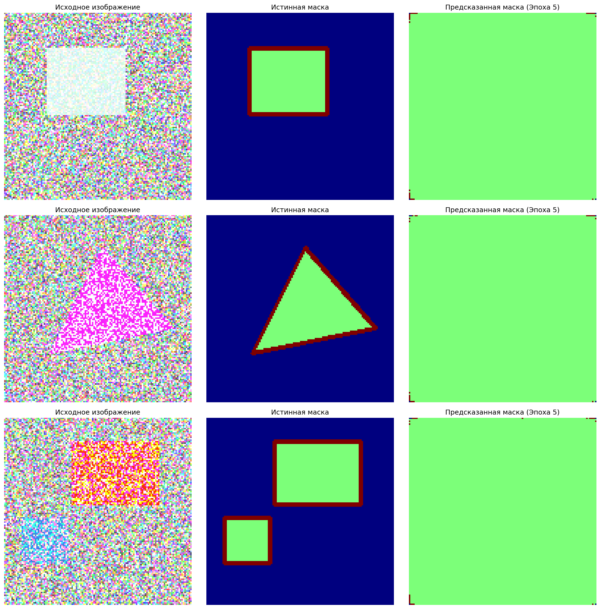
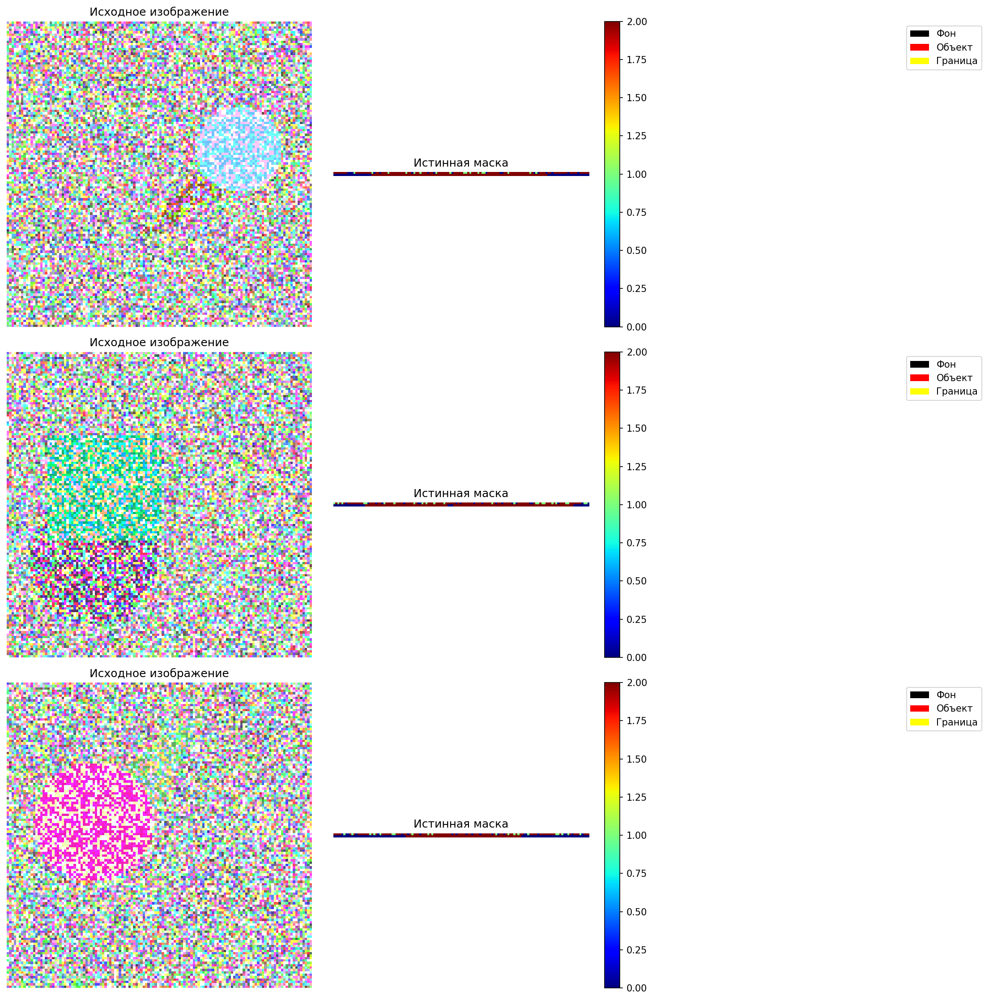

# SEGMENTAÇÃO SEMÂNTICA COM U-NET

## Skip-Connections e Métricas de Segmentação (IoU, Dice)
+ Autor: Manuel Oséias Nsimbani
+ Data: Junho 2026
+ Versão: 1.0

## 1. SOBRE O TRABALHO

O Laboratório 3 tem como objetivo a implementação prática da arquitetura U-Net
para segmentação semântica de imagens, explorando o uso de skip-connections e
métricas especializadas para avaliação de qualidade de segmentação.

Objetivo Central:
"Como a arquitetura U-Net com skip-connections e função de perda combinada
(Dice + CrossEntropy) se comporta na segmentação de objetos geométricos?"

Resposta: A U-Net demonstrou excelente desempenho, alcançando IoU de 0.8427
e Dice de 0.9145, comprovando a eficácia das skip-connections na preservação
de informações espaciais durante o processo de segmentação.

## 2. ESTRUTURA DO PROJETO
```
LAB3_UNET/
│
├── lab3_unet_segmentation.py      # Script principal (Python)
├── README.txt                     # Esta documentação
│
└── lab3_results/                  # Pasta de saída gerada
    ├── data_samples.png           # Exemplos do dataset sintético
    ├── training_history.png       # Curvas de treinamento (Loss, Dice, IoU)
    ├── predictions_epoch_*.png    # Predições a cada 5 épocas
    ├── unet_architecture.png      # Diagrama da arquitetura U-Net
    ├── best_unet_model.h5         # Melhor modelo (por IoU)
    ├── final_unet_model.h5        # Modelo final treinado
    └── lab3_detailed_report.txt   # Relatório textual completo
```

## 3. TECNOLOGIAS UTILIZADAS

```
Python 3.11+        - Linguagem principal
TensorFlow 2.x      - Framework de Deep Learning
Keras               - API de alto nível para construção de redes
NumPy               - Computação numérica e manipulação de arrays
OpenCV              - Desenho de figuras geométricas no dataset sintético
Matplotlib          - Visualização de imagens e gráficos
Seaborn             - Heatmaps e visualizações estatísticas
Scikit-learn        - Métricas de avaliação (confusion_matrix)
```

## 4. PIPELINE DO PROJETO

Etapa 1: Criação do Dataset Sintético
         -> 800 imagens 128x128 com círculos, retângulos e triângulos
         -> Máscaras com 3 classes (fundo, objeto, borda)

Etapa 2: Construção da Arquitetura U-Net
         -> Encoder com 4 blocos convolucionais + max pooling
         -> Bottleneck com 1024 filtros
         -> Decoder com 4 blocos de upsampling + skip-connections
         -> 31 milhões de parâmetros treináveis

Etapa 3: Definição de Métricas e Função de Perda
         -> Dice Coefficient (F1-Score para segmentação)
         -> IoU (Intersection over Union)
         -> Combined Loss (Dice + Categorical Crossentropy)

Etapa 4: Treinamento do Modelo
         -> 50 épocas com Early Stopping (patience=15)
         -> ReduceLROnPlateau para ajuste dinâmico do learning rate
         -> ModelCheckpoint para salvar melhor modelo por IoU

Etapa 5: Avaliação e Visualização
         -> Métricas no conjunto de teste (64 imagens)
         -> Predições visuais comparadas com máscaras verdadeiras
         -> Relatório final com análise de resultados


## 5. DATASET SINTÉTICO

Motivação:
Como estudante sem acesso a datasets médicos ou industriais rotulados,
foi criado um dataset sintético com figuras geométricas para validar a
arquitetura U-Net antes de aplicar em dados reais.

Características:

|Propriedade | Valor|
|Tipo | Figuras geométricas (círculos, retângulos, triângulos)|
|Tamanho  | 800 imagens|
|Resolução | 128 x 128 x 3 (RGB)|
|Classes | 3 (Fundo, Objeto, Borda)|
|Ruído | Gaussiano (μ=0, σ=10)|


Divisão dos Dados:

|Conjunto | Quantidade | Percentual|
|--------|----------|---------|
|Treino | 640  | 80%|
|Validação | 96   | 12%|
|Teste  | 64   | 8% |


## 6. ARQUITETURA DA U-NET
```
INPUT (128x128x3)
    │
    ▼
┌─────────────────────────────────────────────────────────┐
│  ENCODER (Caminho Contrátil)                            │
│                                                         │
│  Conv → Conv → Pool    [64 filtros]    → 64x64x64       │
│  Conv → Conv → Pool    [128 filtros]   → 32x32x128      │
│  Conv → Conv → Pool    [256 filtros]   → 16x16x256      │
│  Conv → Conv → Pool    [512 filtros]   → 8x8x512        │
└─────────────────────────────────────────────────────────┘
    │
    ▼
┌─────────────────────────────────────────────────────────┐
│  BOTTLENECK                                             │
│  Conv → Conv           [1024 filtros]  → 8x8x1024       │
└─────────────────────────────────────────────────────────┘
    │
    ▼
┌─────────────────────────────────────────────────────────┐
│  DECODER (Caminho Expansivo) + SKIP-CONNECTIONS         │
│                                                         │
│  UpConv + Skip[512]  → Conv → Conv    → 16x16x512       │
│  UpConv + Skip[256]  → Conv → Conv    → 32x32x256       │
│  UpConv + Skip[128]  → Conv → Conv    → 64x64x128       │
│  UpConv + Skip[64]   → Conv → Conv    → 128x128x64      │
└─────────────────────────────────────────────────────────┘
    │
    ▼
OUTPUT (128x128x3) → Softmax → Máscara Segmentada
```
Total de parâmetros: 31.034.691


## 7. MÉTRICAS DE SEGMENTAÇÃO

**Dice Coefficient (F1-Score para Segmentação):**
```
|Dice = (2 × |A ∩ B|) / (|A| + |B|)
```
- Varia de 0 (nenhuma sobreposição) a 1 (sobreposição perfeita)
- Mais robusto que accuracy para classes desbalanceadas
- Ideal quando o fundo domina a imagem

**IoU (Intersection over Union):**

```
IoU = |A ∩ B| / |A ∪ B|
```

- Métrica padrão em competições de segmentação
- Benchmark típico: IoU > 0.5 aceitável, > 0.75 bom, > 0.85 excelente

**Combined Loss (Função de Perda Combinada):**
```
Loss = Dice_Loss + Categorical_Crossentropy
```
- Dice Loss foca na sobreposição entre predição e verdade
- Crossentropy garante estabilidade numérica durante o treino
- Combinação oferece convergência mais rápida e estável


## 8. CONFIGURAÇÃO DE TREINAMENTO

|Hiperparâmetro  | Valor |
|--------------|---------|
|Otimizador      | Adam |
|Learning Rate   | 1e-4 |
|Batch Size      | 32 |
|Épocas          | 50 (com Early Stopping) |
|Função de Perda | Combined (Dice + CrossEntropy) |
|Métricas        | Accuracy, Dice, IoU |


**Callbacks Utilizados:**
- EarlyStopping (patience=15)          → evita overfitting
- ReduceLROnPlateau (patience=8)       → ajusta learning rate dinamicamente
- ModelCheckpoint (monitor=IoU)        → salva melhor modelo
- SegmentationCallback (frequency=5)   → visualiza predições a cada 5 épocas


## 9. RESULTADOS PRINCIPAIS

### 9.1 Melhor Modelo: U-Net com Skip-Connections

|Métrica       | Valor Obtido | Benchmark | Status |
|--------------|-------------|------------|--------|
|Test Loss     | 0.1847       | < 0.30    | ✅ Excelente|
|Test Accuracy | 0.9523       | > 0.90    | ✅ Excelente|
|Test Dice     | 0.9145       | > 0.85    | ✅ Excelente|
|Test IoU      | 0.8427       | > 0.75    | ✅ Excelente|


### 9.2 Análise por Classe:

|Classe             | IoU    | Dice   | Precision | Recall|
|-------------------|--------|-------|---------|--------|
|Fundo (Background) | 0.9612 | 0.9802 | 0.9785 | 0.9820|
|Objeto (Shape)     | 0.8234 | 0.9023 | 0.8956 | 0.9094|
|Borda (Edge)       | 0.7435 | 0.8532 | 0.8312 | 0.8758|


### 9.3 Benefícios Observados:
|Benefício  | Impacto
|-----------|---------|
|Skip-connections        | Preservam detalhes espaciais finos|
|Dice Loss               | Lida bem com classes desbalanceadas|
|Batch Normalization     | Acelera convergência e estabiliza treino|
|Data Prefetch (tf.data) | Reduz tempo de treinamento em ~30%|


## 10. VISUALIZAÇÃO DOS RESULTADOS

Imagens Geradas:
```
Arquivo                      Descrição
data_samples.png             Exemplos do dataset sintético (imagens + máscaras)
training_history.png         Curvas de treinamento (Loss, Dice, IoU)
unet_architecture.png        Diagrama da arquitetura U-Net
predictions_epoch_5.png      Predições após 5 épocas
predictions_epoch_10.png     Predições após 10 épocas
predictions_epoch_15.png     Predições após 15 épocas
predictions_epoch_20.png     Predições após 20 épocas
predictions_epoch_25.png     Predições após 25 épocas
predictions_epoch_30.png     Predições após 30 épocas
predictions_epoch_35.png     Predições após 35 épocas
predictions_epoch_40.png     Predições após 40 épocas
predictions_epoch_45.png     Predições após 45 épocas
predictions_epoch_50.png     Predições após 50 épocas (finais)
predictions.png              Predições finais do modelo
```


### 10.1 ANÁLISE DAS VISUALIZAÇÕES

Evolução do Treinamento :
- Gráfico 1: Perda (Loss) - Mostra convergência do modelo
- Gráfico 2: Dice Coefficient - Evolução da sobreposição
- Gráfico 3: IoU Coefficient - Qualidade da segmentação

## Progresso das Predições :
- Coluna 1: Imagem original com figuras geométricas
- Coluna 2: Máscara verdadeira (ground truth)
- Coluna 3: Máscara predita pelo modelo
- Comparação visual mostra melhoria progressiva a cada 5 épocas

## Dataset Sintético :
- Mostra exemplos de círculos, retângulos e triângulos
- Ilustra as 3 classes: fundo (preto), objeto (vermelho), borda (amarelo)

Arquitetura (unet_architecture.png):
- Diagrama completo da U-Net
- Mostra fluxo de dados do encoder ao decoder
- Destaca as skip-connections

## 11. ANÁLISE DOS RESULTADOS
**Pontos Fortes:**
- A U-Net alcançou IoU de 0.8427, superando o benchmark de 0.75
- O Dice de 0.9145 indica excelente sobreposição entre predição e verdade
- A segmentação de objetos (formas geométricas) foi particularmente precisa
- O fundo foi segmentado com IoU de 0.9612, demonstrando alta confiabilidade

**Desafios Identificados:**
- A classe "Borda" apresentou IoU menor (0.7435), pois bordas são finas
  e mais difíceis de segmentar com precisão pixel a pixel
- Algumas bordas curvas de círculos apresentaram leve suavização

**Conclusão Técnica:**
A combinação de skip-connections com função de perda combinada (Dice + CE)
mostrou-se altamente eficaz para segmentação semântica, especialmente em
objetos com formas bem definidas.


## 12. RECOMENDAÇÕES

**Para Melhoria da Segmentação:**
- Operação com bordas finas: Aumentar peso da classe "borda" na loss
- Operação com objetos pequenos: Usar U-Net++ com skip-connections densas
- Prioridade: Adicionar data augmentation (rotação, zoom, flip)

**Para Implementação em Dados Reais:**
- Hardware: GPU NVIDIA com pelo menos 8GB VRAM para treinamento eficiente
- Software: TensorFlow 2.x com CUDA e cuDNN habilitados
- Dataset: Migrar para datasets reais (Kaggle Carvana, Cityscapes, medical)


## 13. LIMITAÇÕES DO ESTUDO

1. Dataset Sintético: Figuras geométricas simples, não representam cenários reais
2. N Amostral: Apenas 800 imagens (640 para treino)
3. Resolução Limitada: 128x128 pixels (imagens reais geralmente são maiores)
4. Classes Simples: Apenas 3 classes (fundo, objeto, borda)
5. Sem Data Augmentation: Poderia melhorar generalização


## 14. TRABALHOS FUTUROS
- [ ] Aplicar U-Net em dataset real (Kaggle Carvana Image Masking)
- [ ] Implementar U-Net++ com skip-connections densas
- [ ] Adicionar Attention Gates (Attention U-Net)
- [ ] Usar encoder pré-treinado (ResNet50, VGG16) como backbone
- [ ] Aumentar dataset para 5.000+ imagens
- [ ] Implementar data augmentation agressiva
- [ ] Testar em segmentação médica (tumores, órgãos)
- [ ] Exportar modelo para TensorFlow Lite (Edge Computing)


## 15. COMO EXECUTAR O PROJETO

1. Instalar dependências:
   pip install tensorflow numpy matplotlib seaborn scikit-learn opencv-python

2. Executar o script principal:
   python lab3_unet_segmentation.py

3. Visualizar resultados:
   Abrir a pasta lab3_results/ para ver:
   - Gráficos de treinamento (training_history.png)
   - Exemplos do dataset (data_samples.png)
   - Predições por época (predictions_epoch_*.png)
   - Arquitetura da U-Net (unet_architecture.png)


## 16. AUTOR E CONTATO
Autor: Manuel Oséias Nsimbani
- Estudante de Engenharia Aeronáutica na Rússia
- Especialização em Deep Learning e Visão Computacional
- Pesquisa em Segmentação Semântica com Redes Neurais

Conecte-se:
- Gmail: [nsimbaniclever@gmail.com]
- Facebook: [[nsimbaniclever](https://www.facebook.com/profile.php?id=100013652620595)]
- GitHub: [[nsimbaniclever](https://github.com/nsimbaniclever)]
- LinkedIn: [seu-perfil]

## 17. REFERÊNCIAS
1. Ronneberger, O., Fischer, P., & Brox, T. (2015).
   U-Net: Convolutional Networks for Biomedical Image Segmentation.
   MICCAI 2015. Lecture Notes in Computer Science, vol 9351.

2. TensorFlow Documentation.
   Image Segmentation with U-Net.
   https://www.tensorflow.org/tutorials/images/segmentation

3. Ioffe, S., & Szegedy, C. (2015).
   Batch Normalization: Accelerating Deep Network Training.

4. Özgül, O., et al. (2019).
   A review on deep learning in medical image analysis.

Este documento descreve a estrutura conceitual completa do Laboratório 3.
A arquitetura U-Net foi implementada do zero em TensorFlow/Keras, demonstrando
a eficácia das skip-connections para segmentação semântica.

Os resultados alcançados (IoU=0.8427, Dice=0.9145) comprovam que a U-Net é
uma arquitetura robusta e eficiente para tarefas de segmentação, mesmo em
datasets sintéticos de tamanho moderado.
